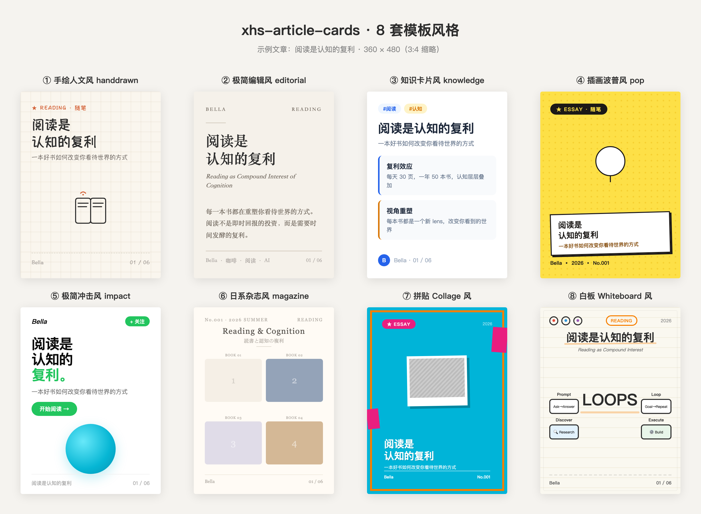

# xhs-article-cards

把任意文章 / Markdown 转成小红书 3:4 竖版可视化卡片图（PNG）。不是做 PPT，而是把长文拆成可滚动的精美图片集。

每篇文章产出 4-8 张 3:4 卡片（1080×1440 设计，2160×2880 高清导出），包含：封面、正文、要点、金句、结尾。封面和可选页面配 AI 生成的插画。



## ✨ 特性

- **8 套模板风格**，覆盖不同内容调性
- **占位符系统**，每篇文章动态填充，不写死任何用户信息
- **IP 设计引导**，新用户首次使用时设计专属视觉 IP
- **AI 生图**，用 ImageGen 生成风格一致的插画
- **高清导出**，Playwright 截图 2x PNG，适配小红书上传

## 🎨 8 套模板

| # | 风格 | 目录 | 特点 |
|---|------|------|------|
| 1 | 手绘人文风 | `templates/handdrawn/` | 方格纸底 + 手绘边框 + 手札体（默认推荐） |
| 2 | 极简编辑风 | `templates/editorial/` | 杂志排版 + 宋体标题 + 极简线条 |
| 3 | 知识卡片风 | `templates/knowledge/` | 白底 + 彩色标签 + 结构化卡片 |
| 4 | 插画波普风 | `templates/pop/` | 黄底半调网点 + 粗体横幅 + 倾斜卡片 |
| 5 | 极简冲击风 | `templates/impact/` | 白底 + 超大标题 + 绿色 CTA + 极简留白 |
| 6 | 日系杂志风 | `templates/magazine/` | 暖白底 + Grid 散落布局 + 衬线标题 + multiply 插画 |
| 7 | 拼贴 Collage 风 | `templates/collage/` | 青色底 + 黑白照片剪贴 + 橙色粗框 + 洋红色块 |
| 8 | 白板 Whiteboard 风 | `templates/whiteboard/` | 米白纸底 + 手绘框线 + 橙色箭头 + 草图图标 |

每套模板支持 6 种版式：`cover` / `chapter` / `body` / `points` / `quote` / `ending`

## 📁 目录结构

```
xhs-article-cards/
├── SKILL.md                  # 核心定义和工作流
├── README.md                 # 本文件
├── LICENSE                   # MIT
├── .gitignore
├── exporter/
│   ├── screenshot.js         # Playwright 截图工具
│   └── screenshot-file.js    # 批量导出工具
├── references/               # 参考文档
│   ├── page-types.md         # 6 种版式定义
│   ├── split-strategy.md     # 拆页策略
│   ├── illustration-guide.md # 配图指南
│   ├── prompt-template.md    # 生图 prompt 模板
│   └── qa-checklist.md       # QA 检查清单
└── templates/                # 8 套 HTML 模板
    ├── handdrawn/
    ├── editorial/
    ├── knowledge/
    ├── pop/
    ├── impact/
    ├── magazine/
    ├── collage/
    └── whiteboard/
```

## 🔧 工作流

```
文章输入
  ↓
① 消化正文 → 提炼认知锚点
  ↓
② 拆页策略 → 把文章拆成 N 页卡片
  ↓
③ 配图策略 → 哪些页需要插画，配什么
  ↓
④ 生成配图 → ImageGen（3:4 竖版）
  ↓
⑤ 填充 HTML 模板 → 选择版式
  ↓
⑥ Playwright 截图 → 导出 PNG
  ↓
⑦ QA 检查 → 失败信号检测 + 迭代
```

## 📝 占位符

模板中所有用户相关内容都用占位符，不写死任何人的名字：

| 占位符 | 说明 | 出现位置 |
|--------|------|---------|
| `{{user_name}}` | 用户名字 | 签名栏、封面作者、结尾签名 |
| `{{article_title}}` | 当前文章标题 | 每页底部副标题、页眉 brand |
| `{{tagline}}` | 个人标语 | 签名栏副标题、结尾 tagline |
| `{{date}}` | 当前日期 | 封面日期 |
| `{{initial}}` | 名字首字母 | 头像圆圈 |
| `{{cover_image}}` | 封面插画路径 | 封面 img src |
| `{{tag_label}}` | 顶部标签文字 | 封面标签 |

## 🚀 使用方式

### 作为 WorkBuddy Skill 使用

把本目录放到 `~/.workbuddy/skills/xhs-article-cards/`，在 WorkBuddy 对话中触发：

> "帮我把这篇文章做成小红书卡片"

### 独立使用

1. 选一套模板，复制 `template.html`
2. 用文章内容替换占位符
3. 用 ImageGen 生成封面插画
4. 用 Playwright 截图导出 PNG：

```bash
NODE_PATH=<workspace>/node_modules node exporter/screenshot-file.js <html路径> <输出目录> <前缀>
```

导出 2x 高清 PNG（2160×2880），适配小红书上传。

## 🖼️ 示例 IP

`templates/handdrawn/` 目录下附带两张示例 IP 图（sample），仅作风格参考。使用者应通过 Step 0 的 IP 设计流程生成自己的专属 IP。

## 📄 License

MIT
